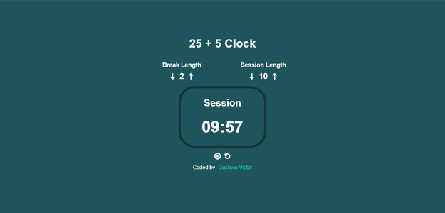
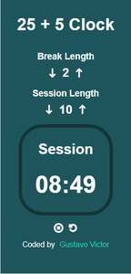

<h1 align='center'>Pomodoro Clock ⏳</h1>

<p align="center">
  <a href="#-sobre">Sobre</a>&nbsp;&nbsp;&nbsp;|&nbsp;&nbsp;&nbsp;
  <a href="#-layout">Layout</a>&nbsp;&nbsp;&nbsp;|&nbsp;&nbsp;&nbsp;
  <a href="#-tecnologias-e-ferramentas">Tecnologias e Ferramentas</a>&nbsp;&nbsp;&nbsp;|&nbsp;&nbsp;&nbsp;
  <a href="#-funcionalidades">Funcionalidades</a>&nbsp;&nbsp;&nbsp;|&nbsp;&nbsp;&nbsp;
  <a href="#-instalação">Instalação</a>&nbsp;&nbsp;&nbsp;|&nbsp;&nbsp;&nbsp;
  <a href="#-licença">Licença</a>&nbsp;&nbsp;&nbsp;|&nbsp;&nbsp;&nbsp;
</p>

<p align="center">
    ✔ Projeto concluído
</p>

<p align="center">
    
    
    
    
    
</p>

<hr/>


## ❓ Sobre

Este projeto é um contador regressivo feito em React. O projeto faz parte de um [desafio](https://www.freecodecamp.org/learn/front-end-development-libraries/front-end-development-libraries-projects/build-a-25--5-clock) da [freeCodeCamp](https://www.freecodecamp.org) no curso de bibliotecas e frameworks front-end. O intuito do projeto é treinar as habilidades aprendizas durante curso. 

Clique [aqui](https://yxnsm0-5173.csb.app/) para ver o projeto no [CodeSandbox](https://codesandbox.io). 


## 🎨 Layout

 


## 🛠 Tecnologias e Ferramentas

- [HTML](https://developer.mozilla.org/pt-BR/docs/Web/HTML)
- [CSS](https://developer.mozilla.org/pt-BR/docs/Web/CSS)
- [ReactJS](https://pt-br.reactjs.org/)
- [TypeScript](https://www.typescriptlang.org)
- [React Icons](https://react-icons.github.io/react-icons/)
- [Vite](https://vitejs.dev/)

Veja como ficou o arquivo [package.json](./package.json) 


## ⚙ Funcionalidades 

- [x] Iniciar, pausar e exibir contador regressivo
- [x] Resetar contador
- [x] Definir tempo de sessão 
- [x] Definir tempo de intervalo
- [x] Tocar áudio quando contador chega a zero  


## 💻 Instalação 

Para abrir e executar o projeto no seu computador, você vai precisar ter o [Node.js](https://nodejs.org/en) instalado na sua máquina (recomendo baixar a versão LTS). Além disso, para conseguir executar os comandos de terminal a seguir, você precisará instalar o [GIT](https://git-scm.com/). 
É recomendado ter alguns conhecimentos básicos de HTML, CSS, JavaScript e React para conseguir entender os códigos do projeto e também ter alguma noção prévia de comandos de terminal para conseguir acompanhar as instruções no seu computador. 
Após ter certeza de que tudo está instalado no seu computador, basta acompanhar os passos a seguir: 


1. Faça download do projeto ou clone ele com o seguinte comando no terminal: 

```bash 
    git clone https://github.com/Gustavo-Victor/pomodoro-clock.git
```
 
2. Descompacte o arquivo do projeto e abra a pasta do projeto; se tiver clonado basta só abrir a pasta do projeto; você pode abrir a pasta usando o seguinte comando: 

```bash 
    cd pomodoro-clock/ 
```

3. Instale as dependências necessárias do projeto (a pasta do projeto precisa estar aberta no terminal): 

```bash 
    npm i -g yarn ;
    yarn install ; 
```

4. Executar o projeto em modo de desenvolvimento: 

```bash 
    yarn dev 
```

5. Abrir o projeto no seu navegador de preferência. (Basta digitar na barra de pesquisa: http://localhost:5173/). 


<hr/>

## 📝 Licença 

O projeto está sob a Licensa MIT 

Qualquer pessoa pode usar, clonar e contribuir com este projeto. 

Clique [aqui](./LICENSE.md) para saber mais  


